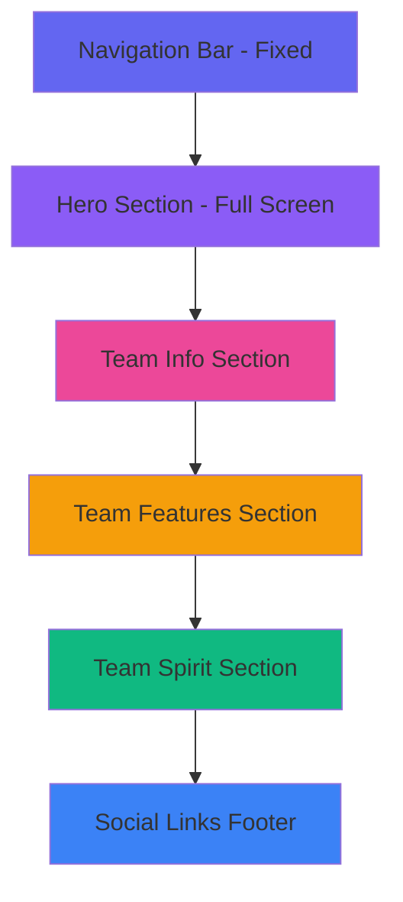

# Design Document

## Overview

本设计文档描述了 Funk & Love 舞队现代化主页的技术架构和实现方案。该主页基于 Next.js 15+ 和 React 19，使用 Tailwind CSS 4 进行样式设计，Framer Motion 实现动画效果。整体设计遵循单页应用（SPA）模式，通过平滑滚动在不同内容区域间导航。

设计理念强调：
- **视觉冲击力**：大胆的排版、动态的动画、强烈的视觉层次
- **流畅交互**：60fps 动画、平滑滚动、即时反馈
- **响应式优先**：移动端优先设计，完美适配所有设备
- **可维护性**：组件化架构、集中配置、清晰的代码结构

## Architecture

### Technology Stack

- **Framework**: Next.js 16.0.3 (App Router)
- **UI Library**: React 19.2.0
- **Styling**: Tailwind CSS 4
- **Animation**: Framer Motion 11+
- **Icons**: Lucide React
- **Typography**: Google Fonts (Geist Sans, 可选添加更具街舞风格的字体)
- **Image Handling**: Next.js Image Component with fallback system

### Project Structure

```
app/
├── layout.tsx              # Root layout with metadata
├── page.tsx                # Main homepage
├── globals.css             # Global styles and Tailwind directives
└── components/
    ├── Hero.tsx            # Hero section component
    ├── Navigation.tsx      # Navigation bar component
    ├── TeamInfo.tsx        # Team information section
    ├── TeamFeatures.tsx    # Team features cards
    ├── TeamSpirit.tsx      # Team spirit/slogan section
    ├── SocialLinks.tsx     # Social media links
    └── ui/
        ├── ImagePlaceholder.tsx  # Reusable image placeholder
        ├── Card.tsx              # Card component
        └── Button.tsx            # Button component
lib/
├── constants.ts            # Site configuration and content
└── utils.ts                # Utility functions
public/
├── images/
│   ├── hero-bg.jpg         # Hero background (placeholder)
│   ├── team-photo.jpg      # Team photo (placeholder)
│   └── features/           # Feature images
└── icons/
    └── favicon.ico         # From S3 URL
```


### Page Layout Flow



## Components and Interfaces

### 1. Navigation Component

**Purpose**: 提供固定导航栏，支持平滑滚动和移动端汉堡菜单

**Props Interface**:
```typescript
interface NavigationProps {
  links: Array<{
    id: string;
    label: string;
    href: string;
  }>;
}
```

**Key Features**:
- 固定在页面顶部，滚动时添加背景模糊效果
- 桌面端：水平导航链接
- 移动端：汉堡菜单 + 全屏侧边栏
- 使用 Framer Motion 实现菜单展开/收起动画
- 点击链接触发平滑滚动（使用 `scrollIntoView` 或 `framer-motion` 的 scroll 功能）

**Styling**:
- 背景：半透明毛玻璃效果 (`backdrop-blur-md bg-white/80`)
- 高度：64px (桌面) / 56px (移动)
- Z-index: 50

### 2. Hero Section Component

**Purpose**: 主页顶部大型视觉展示区，传递核心信息和气势

**Props Interface**:
```typescript
interface HeroProps {
  title: string;
  slogan: string;
  description: string;
  backgroundImage?: string;
}
```

**Key Features**:
- 全屏高度 (`min-h-screen`)
- 动态渐变背景：鼠标跟随径向渐变
- 背景图片（可选）+ 深色遮罩层（确保文字可读性）
- 渐入动画：标题、Slogan、描述依次出现
- 向下滚动指示器（动画箭头）
- 响应式文字大小

**Dynamic Background**:
- 使用鼠标跟随渐变，创造动态视觉效果
- 移动端：使用滚动驱动渐变或自动动画
- 渐变色从鼠标位置向外扩散

**Animation Sequence**:
1. 背景渐变启动 (0s)
2. 标题从下方滑入 + 淡入 (0.3-0.9s)
3. Slogan 淡入 (0.6-1.2s)
4. 描述文字淡入 (0.9-1.5s)

**Styling**:
- 标题：`text-6xl md:text-8xl font-bold`
- Slogan：`text-2xl md:text-4xl font-light italic`
- 配色：白色文字 + 动态渐变背景
- 文字添加微妙的发光效果 (`text-shadow`)


### 3. Team Info Section Component

**Purpose**: 展示团队基本信息，使用视觉化布局

**Props Interface**:
```typescript
interface TeamInfoProps {
  teamName: string;
  organization: string;
  danceStyle: string;
  memberCount: string;
  description: string;
  image?: string;
}
```

**Layout**:
- 两栏布局（桌面）：左侧图片，右侧信息
- 单栏布局（移动）：图片在上，信息在下
- 信息以图标 + 文字形式展示

**Key Features**:
- 滚动触发动画：进入视口时从左/右滑入
- 信息项使用图标（Lucide Icons）
- 图片使用 ImagePlaceholder 组件

**Styling**:
- 容器：`max-w-7xl mx-auto px-4 py-20`
- 图片：圆角 + 阴影效果
- 信息项：垂直排列，间距均匀

### 4. Team Features Component

**Purpose**: 以卡片形式展示团队 4 大特色

**Props Interface**:
```typescript
interface Feature {
  icon: LucideIcon;
  title: string;
  description: string;
}

interface TeamFeaturesProps {
  features: Feature[];
}
```

**Layout**:
- 4 列网格（桌面）
- 2 列网格（平板）
- 1 列网格（移动）

**Key Features**:
- 每个卡片包含图标、标题、描述
- 悬停效果：卡片上浮 + 阴影增强 + 动态背景色
- 滚动触发动画：卡片依次淡入（stagger 效果）
- 鼠标距离驱动的颜色变化

**Dynamic Effects**:
- 计算鼠标与每个卡片的距离
- 距离越近，卡片背景色越接近主色调
- 创造"波纹"或"磁场"效果
- 图标颜色根据鼠标位置动态变化

**Styling**:
- 卡片：半透明背景，圆角，阴影，backdrop-blur
- 图标：大尺寸，动态渐变色
- 悬停：`transform: translateY(-8px)`, `shadow-xl`, 背景色变化

### 5. Team Spirit Component

**Purpose**: 突出展示 Slogan 和团队理念

**Props Interface**:
```typescript
interface TeamSpiritProps {
  slogan: string;
  philosophy: string;
}
```

**Layout**:
- 全宽背景区域
- 居中大字号文字
- 动态渐变背景

**Key Features**:
- 大胆的排版设计
- 文字动画：逐字淡入或打字机效果
- 背景：滚动驱动渐变，随页面滚动改变颜色
- 鼠标跟随光晕效果

**Dynamic Effects**:
- 背景色根据滚动位置在多个颜色间过渡
- 文字添加动态发光效果
- 鼠标悬停时文字颜色微妙变化

**Styling**:
- Slogan：`text-5xl md:text-7xl font-black text-center`
- 理念：`text-xl md:text-2xl font-light text-center mt-6`
- 配色：动态渐变背景 + 白色文字 + 发光效果


### 6. Social Links Component

**Purpose**: 展示社交媒体链接，支持筹备中状态

**Props Interface**:
```typescript
interface SocialLink {
  platform: string;
  icon: LucideIcon;
  url?: string;
  isComingSoon: boolean;
}

interface SocialLinksProps {
  links: SocialLink[];
}
```

**Layout**:
- 水平排列图标
- 居中对齐
- 位于页面底部

**Key Features**:
- 图标悬停效果：放大 + 颜色变化
- 筹备中状态：灰色 + "筹备中" 标签 + 禁用点击
- 可点击链接在新标签页打开

**Styling**:
- 图标大小：48px
- 间距：`gap-6`
- 悬停：`scale-110`, 平台品牌色

### 7. ImagePlaceholder Component

**Purpose**: 统一的图片占位符组件，处理图片加载失败

**Props Interface**:
```typescript
interface ImagePlaceholderProps {
  src?: string;
  alt: string;
  width?: number;
  height?: number;
  className?: string;
  placeholderText?: string;
}
```

**Key Features**:
- 使用 Next.js Image 组件
- 图片加载失败时显示占位符
- 占位符显示 "404 - 图片待补充" 或自定义文字
- 支持骨架屏加载状态

**Implementation**:
```typescript
const [imageError, setImageError] = useState(false);

if (imageError || !src) {
  return (
    <div className="placeholder-container">
      <p>{placeholderText || "404 - 图片待补充"}</p>
    </div>
  );
}

return (
  <Image
    src={src}
    alt={alt}
    onError={() => setImageError(true)}
    {...props}
  />
);
```

## Data Models

### Site Configuration

集中管理站点内容和配置，存储在 `lib/constants.ts`

```typescript
export const SITE_CONFIG = {
  name: "Funk & Love",
  slogan: "Lock it, Point it, Groove it!",
  description: "浙江大学DFM街舞社Locking团队",
  organization: "浙江大学DFM街舞社",
  danceStyle: "Locking（锁舞）",
  memberCount: "40+",
  
  teamDescription: `
    Funk & Love是浙江大学DFM街舞社的Locking团队，
    我们用充满律动的锁舞诠释放克精神。
    Locking是一种充满欢乐和表现力的街舞风格，
    以突然的"锁定"动作、指向性手势Point和夸张的表情为特征。
  `,
  
  philosophy: "用舞蹈传递快乐",
  
  features: [
    {
      icon: "Music",
      title: "充满律动的Locking舞蹈",
      description: "专业的Locking技巧训练，感受放克音乐的魅力"
    },
    {
      icon: "Heart",
      title: "欢乐友爱的团队氛围",
      description: "温暖的大家庭，每个人都能找到归属感"
    },
    {
      icon: "Users",
      title: "专业的舞蹈指导",
      description: "经验丰富的导师团队，系统化的教学体系"
    },
    {
      icon: "Sparkles",
      title: "丰富的演出机会",
      description: "校内外各类演出平台，展示自我风采"
    }
  ],
  
  socialLinks: [
    {
      platform: "抖音",
      icon: "Video",
      url: "https://www.douyin.com/user/MS4wLjABAAAAowd4J-nvC1oFpGl7FmBJ78xwqblR_a_wSAIiiYG5V1HEKfTwStguqsSPbARI7WuV",
      isComingSoon: false
    },
    {
      platform: "微信视频号",
      icon: "MessageCircle",
      url: undefined,
      isComingSoon: true
    },
    {
      platform: "B站",
      icon: "Tv",
      url: undefined,
      isComingSoon: true
    },
    {
      platform: "Instagram",
      icon: "Instagram",
      url: undefined,
      isComingSoon: true
    }
  ],
  
  images: {
    hero: "/images/hero-bg.jpg",
    teamPhoto: "/images/team-photo.jpg",
    favicon: "https://funkandlove-main.s3.bitiful.net/public/favicon.ico",
    logo: "https://funkandlove-main.s3.bitiful.net/public/icon.png"
  }
};

export const NAV_LINKS = [
  { id: "home", label: "首页", href: "#hero" },
  { id: "about", label: "团队介绍", href: "#team-info" },
  { id: "features", label: "团队特色", href: "#features" },
  { id: "contact", label: "联系我们", href: "#social" }
];
```


## Design System

### Color Palette

基于街舞文化的活力和专业性，采用大胆的动态渐变色方案：

```css
/* Primary Colors - 主色调 */
--primary-purple: #8b5cf6;    /* 紫色 - 神秘、专业 */
--primary-orange: #f59e0b;    /* 橙色 - 活力、热情 */
--primary-blue: #3b82f6;      /* 蓝色 - 信任、稳定 */

/* Accent Colors - 强调色 */
--accent-pink: #ec4899;       /* 粉色 - 年轻、时尚 */
--accent-green: #10b981;      /* 绿色 - 成长、希望 */

/* Neutral Colors - 中性色 */
--neutral-900: #111827;       /* 深色背景 */
--neutral-100: #f3f4f6;       /* 浅色背景 */
--neutral-white: #ffffff;     /* 白色 */
```

### Dynamic Gradient System

**设计理念**: 避免静态渐变的 AI 感，使用动态、交互式的渐变效果

**实现方案**:

1. **鼠标跟随渐变** (Hero Section & Team Spirit)
   - 使用 CSS 变量 + JavaScript 追踪鼠标位置
   - 渐变中心点跟随鼠标移动
   - 实现径向渐变效果，从鼠标位置向外扩散

```typescript
// 鼠标跟随渐变实现
const [mousePosition, setMousePosition] = useState({ x: 50, y: 50 });

useEffect(() => {
  const handleMouseMove = (e: MouseEvent) => {
    const x = (e.clientX / window.innerWidth) * 100;
    const y = (e.clientY / window.innerHeight) * 100;
    setMousePosition({ x, y });
  };
  window.addEventListener('mousemove', handleMouseMove);
  return () => window.removeEventListener('mousemove', handleMouseMove);
}, []);

// CSS 样式
style={{
  background: `radial-gradient(circle at ${mousePosition.x}% ${mousePosition.y}%, 
    #8b5cf6 0%, #ec4899 50%, #111827 100%)`
}}
```

2. **滚动驱动渐变** (Background & Sections)
   - 根据页面滚动位置动态改变颜色
   - 使用 Framer Motion 的 `useScroll` 和 `useTransform`
   - 平滑过渡不同色彩区间

```typescript
// 滚动驱动渐变实现
const { scrollYProgress } = useScroll();
const backgroundColor = useTransform(
  scrollYProgress,
  [0, 0.25, 0.5, 0.75, 1],
  ['#8b5cf6', '#ec4899', '#f59e0b', '#3b82f6', '#10b981']
);
```

3. **网格渐变动画** (Features Section)
   - 使用 CSS Grid + 动态背景色
   - 每个卡片的背景色根据鼠标距离变化
   - 创造"波纹"效果

```typescript
// 计算鼠标与卡片的距离，动态调整颜色
const distance = Math.sqrt(
  Math.pow(mouseX - cardX, 2) + Math.pow(mouseY - cardY, 2)
);
const intensity = Math.max(0, 1 - distance / 500);
const color = interpolateColor('#8b5cf6', '#ec4899', intensity);
```

4. **光标光晕效果** (Global)
   - 全局鼠标光晕，跟随鼠标移动
   - 使用 `pointer-events: none` 避免干扰交互
   - 模糊效果 + 混合模式创造氛围感

```css
.cursor-glow {
  position: fixed;
  width: 400px;
  height: 400px;
  border-radius: 50%;
  background: radial-gradient(circle, rgba(139, 92, 246, 0.3) 0%, transparent 70%);
  pointer-events: none;
  mix-blend-mode: screen;
  filter: blur(40px);
  z-index: 9999;
}
```

### Typography

```css
/* Font Families */
--font-sans: 'Geist Sans', system-ui, sans-serif;
--font-display: 'Geist Sans', sans-serif; /* 可选：添加更具冲击力的字体 */

/* Font Sizes */
--text-xs: 0.75rem;      /* 12px */
--text-sm: 0.875rem;     /* 14px */
--text-base: 1rem;       /* 16px */
--text-lg: 1.125rem;     /* 18px */
--text-xl: 1.25rem;      /* 20px */
--text-2xl: 1.5rem;      /* 24px */
--text-3xl: 1.875rem;    /* 30px */
--text-4xl: 2.25rem;     /* 36px */
--text-5xl: 3rem;        /* 48px */
--text-6xl: 3.75rem;     /* 60px */
--text-7xl: 4.5rem;      /* 72px */
--text-8xl: 6rem;        /* 96px */

/* Font Weights */
--font-light: 300;
--font-normal: 400;
--font-medium: 500;
--font-semibold: 600;
--font-bold: 700;
--font-black: 900;
```

### Spacing & Layout

```css
/* Container Max Widths */
--container-sm: 640px;
--container-md: 768px;
--container-lg: 1024px;
--container-xl: 1280px;
--container-2xl: 1536px;

/* Spacing Scale */
--space-1: 0.25rem;   /* 4px */
--space-2: 0.5rem;    /* 8px */
--space-4: 1rem;      /* 16px */
--space-6: 1.5rem;    /* 24px */
--space-8: 2rem;      /* 32px */
--space-12: 3rem;     /* 48px */
--space-16: 4rem;     /* 64px */
--space-20: 5rem;     /* 80px */
--space-24: 6rem;     /* 96px */
```

### Shadows & Effects

```css
/* Shadows */
--shadow-sm: 0 1px 2px 0 rgb(0 0 0 / 0.05);
--shadow-md: 0 4px 6px -1px rgb(0 0 0 / 0.1);
--shadow-lg: 0 10px 15px -3px rgb(0 0 0 / 0.1);
--shadow-xl: 0 20px 25px -5px rgb(0 0 0 / 0.1);
--shadow-2xl: 0 25px 50px -12px rgb(0 0 0 / 0.25);

/* Blur Effects */
--blur-sm: 4px;
--blur-md: 8px;
--blur-lg: 16px;

/* Border Radius */
--radius-sm: 0.25rem;   /* 4px */
--radius-md: 0.5rem;    /* 8px */
--radius-lg: 1rem;      /* 16px */
--radius-xl: 1.5rem;    /* 24px */
--radius-full: 9999px;
```

## Animation Strategy

### Framer Motion Variants

定义可复用的动画变体：

```typescript
// lib/animations.ts

export const fadeInUp = {
  initial: { opacity: 0, y: 60 },
  animate: { opacity: 1, y: 0 },
  transition: { duration: 0.6, ease: "easeOut" }
};

export const fadeIn = {
  initial: { opacity: 0 },
  animate: { opacity: 1 },
  transition: { duration: 0.8 }
};

export const slideInLeft = {
  initial: { opacity: 0, x: -60 },
  animate: { opacity: 1, x: 0 },
  transition: { duration: 0.6, ease: "easeOut" }
};

export const slideInRight = {
  initial: { opacity: 0, x: 60 },
  animate: { opacity: 1, x: 0 },
  transition: { duration: 0.6, ease: "easeOut" }
};

export const staggerContainer = {
  animate: {
    transition: {
      staggerChildren: 0.1
    }
  }
};

export const scaleOnHover = {
  whileHover: { scale: 1.05 },
  whileTap: { scale: 0.95 }
};
```

### Scroll-Triggered Animations

使用 Framer Motion 的 `useInView` hook 实现滚动触发动画：

```typescript
import { useInView } from "framer-motion";
import { useRef } from "react";

const ref = useRef(null);
const isInView = useInView(ref, { once: true, margin: "-100px" });

<motion.div
  ref={ref}
  initial={{ opacity: 0, y: 50 }}
  animate={isInView ? { opacity: 1, y: 0 } : { opacity: 0, y: 50 }}
  transition={{ duration: 0.6 }}
>
  {/* Content */}
</motion.div>
```

### Performance Optimization

- 使用 `will-change` CSS 属性提示浏览器优化
- 动画仅应用于 `transform` 和 `opacity` 属性（GPU 加速）
- 避免在动画中使用 `width`, `height`, `top`, `left` 等触发重排的属性
- 使用 `useReducedMotion` hook 尊重用户的动画偏好设置


## Responsive Design Strategy

### Breakpoints

```typescript
// Tailwind CSS 默认断点
const breakpoints = {
  sm: '640px',   // 手机横屏
  md: '768px',   // 平板竖屏
  lg: '1024px',  // 平板横屏 / 小笔记本
  xl: '1280px',  // 桌面
  '2xl': '1536px' // 大屏桌面
};
```

### Layout Adaptations

| Component | Mobile (<768px) | Tablet (768-1024px) | Desktop (>1024px) |
|-----------|----------------|---------------------|-------------------|
| Navigation | 汉堡菜单 | 水平导航 | 水平导航 |
| Hero | 单列，文字居中 | 单列，文字居中 | 单列，文字居中 |
| Team Info | 单列（图片上，文字下） | 单列 | 两列（图片左，文字右） |
| Features | 1列网格 | 2列网格 | 4列网格 |
| Team Spirit | 单列 | 单列 | 单列 |
| Social Links | 图标缩小，垂直排列 | 水平排列 | 水平排列 |

### Touch Optimization

- 所有可点击元素最小触摸区域：44x44px
- 增加移动端按钮和链接的内边距
- 禁用移动端的悬停效果，使用点击反馈
- 优化滚动性能，使用 `touch-action` CSS 属性

## Error Handling

### Image Loading Errors

**Strategy**: 使用 ImagePlaceholder 组件统一处理

```typescript
// 图片加载失败时的处理流程
1. 尝试加载图片
2. 如果失败，触发 onError 事件
3. 设置 imageError 状态为 true
4. 渲染占位符 UI（灰色背景 + "404 - 图片待补充" 文字）
5. 记录错误到控制台（开发环境）
```

**Fallback UI**:
```tsx
<div className="flex items-center justify-center bg-neutral-200 rounded-lg">
  <div className="text-center p-8">
    <p className="text-neutral-500 text-lg">404 - 图片待补充</p>
    <p className="text-neutral-400 text-sm mt-2">
      建议尺寸：{width}x{height}px
    </p>
  </div>
</div>
```

### Navigation Errors

**Strategy**: 平滑滚动失败时的降级处理

```typescript
const scrollToSection = (id: string) => {
  try {
    const element = document.getElementById(id);
    if (element) {
      element.scrollIntoView({ behavior: 'smooth', block: 'start' });
    }
  } catch (error) {
    // 降级到普通跳转
    window.location.hash = id;
  }
};
```

### Social Link Errors

**Strategy**: 筹备中状态和无效链接的处理

```typescript
const handleSocialClick = (link: SocialLink) => {
  if (link.isComingSoon || !link.url) {
    // 显示提示信息，不执行跳转
    return;
  }
  window.open(link.url, '_blank', 'noopener,noreferrer');
};
```

## Testing Strategy

### Component Testing

使用 React Testing Library 进行组件测试：

**测试重点**:
1. **Navigation Component**
   - 导航链接渲染正确
   - 点击链接触发滚动
   - 移动端菜单展开/收起

2. **ImagePlaceholder Component**
   - 图片正常加载时显示图片
   - 图片加载失败时显示占位符
   - 无 src 时显示占位符

3. **SocialLinks Component**
   - 所有链接渲染正确
   - 筹备中状态显示正确
   - 可用链接可点击，筹备中链接不可点击

4. **Responsive Behavior**
   - 不同视口宽度下布局正确
   - 移动端触摸交互正常

### Visual Regression Testing

**可选**: 使用 Playwright 或 Chromatic 进行视觉回归测试

**测试场景**:
- 不同屏幕尺寸的截图对比
- 动画关键帧截图
- 悬停状态截图

### Performance Testing

**指标**:
- First Contentful Paint (FCP) < 1.5s
- Largest Contentful Paint (LCP) < 2.5s
- Cumulative Layout Shift (CLS) < 0.1
- First Input Delay (FID) < 100ms
- 动画帧率 > 50 FPS

**工具**:
- Lighthouse CI
- Chrome DevTools Performance Panel
- Web Vitals 库

### Accessibility Testing

**检查项**:
- 键盘导航支持
- 屏幕阅读器兼容性
- 颜色对比度符合 WCAG AA 标准
- 所有图片有 alt 文本
- 语义化 HTML 标签

**工具**:
- axe DevTools
- WAVE Browser Extension
- Lighthouse Accessibility Audit

## Deployment Considerations

### Build Optimization

```typescript
// next.config.ts
const nextConfig = {
  images: {
    domains: ['funkandlove-main.s3.bitiful.net'],
    formats: ['image/avif', 'image/webp'],
  },
  compiler: {
    removeConsole: process.env.NODE_ENV === 'production',
  },
};
```

### Environment Variables

```env
# .env.local
NEXT_PUBLIC_SITE_URL=https://funkandlove.com
NEXT_PUBLIC_S3_BUCKET=funkandlove-main.s3.bitiful.net
```

### SEO Optimization

```typescript
// app/layout.tsx metadata
export const metadata: Metadata = {
  title: 'Funk & Love - 浙江大学DFM街舞社Locking团队',
  description: '用舞蹈传递快乐。Funk & Love是浙江大学DFM街舞社的Locking团队，我们用充满律动的锁舞诠释放克精神。',
  keywords: ['Funk & Love', 'Locking', '街舞', '浙江大学', 'DFM'],
  authors: [{ name: 'Hofmann88' }],
  openGraph: {
    title: 'Funk & Love',
    description: '用舞蹈传递快乐',
    images: ['https://funkandlove-main.s3.bitiful.net/public/icon.png'],
  },
  icons: {
    icon: 'https://funkandlove-main.s3.bitiful.net/public/favicon.ico',
  },
};
```

## Implementation Notes

### Dependencies to Install

```bash
npm install framer-motion lucide-react
```

### Dynamic Gradient Utilities

创建工具函数处理动态渐变：

```typescript
// lib/gradients.ts

// 颜色插值函数
export function interpolateColor(color1: string, color2: string, factor: number): string {
  const c1 = hexToRgb(color1);
  const c2 = hexToRgb(color2);
  const r = Math.round(c1.r + (c2.r - c1.r) * factor);
  const g = Math.round(c1.g + (c2.g - c1.g) * factor);
  const b = Math.round(c1.b + (c2.b - c1.b) * factor);
  return `rgb(${r}, ${g}, ${b})`;
}

// 计算鼠标与元素的距离
export function getDistanceFromMouse(
  mouseX: number,
  mouseY: number,
  elementX: number,
  elementY: number
): number {
  return Math.sqrt(
    Math.pow(mouseX - elementX, 2) + Math.pow(mouseY - elementY, 2)
  );
}

// 鼠标跟随 Hook
export function useMousePosition() {
  const [position, setPosition] = useState({ x: 0, y: 0 });
  
  useEffect(() => {
    const handleMouseMove = (e: MouseEvent) => {
      setPosition({ x: e.clientX, y: e.clientY });
    };
    window.addEventListener('mousemove', handleMouseMove);
    return () => window.removeEventListener('mousemove', handleMouseMove);
  }, []);
  
  return position;
}
```

### File Creation Order

建议按以下顺序创建文件，确保依赖关系清晰：

1. `lib/constants.ts` - 站点配置
2. `lib/animations.ts` - 动画变体
3. `lib/gradients.ts` - 动态渐变工具函数
4. `app/components/ui/ImagePlaceholder.tsx` - 基础组件
5. `app/components/ui/Card.tsx` - 基础组件
6. `app/components/ui/Button.tsx` - 基础组件
7. `app/components/ui/CursorGlow.tsx` - 鼠标光晕效果
8. `app/components/Navigation.tsx` - 导航组件
9. `app/components/Hero.tsx` - Hero 区域（含动态渐变）
10. `app/components/TeamInfo.tsx` - 团队信息
11. `app/components/TeamFeatures.tsx` - 团队特色（含鼠标距离效果）
12. `app/components/TeamSpirit.tsx` - 团队精神（含滚动驱动渐变）
13. `app/components/SocialLinks.tsx` - 社交链接
14. `app/page.tsx` - 主页面组装
15. `app/layout.tsx` - 更新 metadata
16. `app/globals.css` - 更新全局样式

### Code Style Guidelines

- 使用 TypeScript 严格模式
- 组件使用函数式组件 + hooks
- Props 使用 interface 定义
- 使用 Tailwind CSS 类名，避免内联样式
- 动画使用 Framer Motion，避免 CSS 动画
- 注释使用中文，代码使用英文

## Design Decisions & Rationale

### 为什么选择 Framer Motion？

- 声明式 API，易于维护
- 优秀的性能优化
- 内置滚动触发动画支持
- 与 React 深度集成

### 为什么使用单页应用模式？

- 主页内容相对简单，不需要多页面
- 平滑滚动提供更好的用户体验
- 减少页面加载次数，提升性能

### 为什么使用动态渐变而非静态渐变？

- 避免 AI 生成的"模板感"
- 增强用户交互体验，提升参与感
- 鼠标跟随和滚动驱动创造独特的视觉效果
- 体现街舞文化的动感和活力
- 让每次访问都有不同的视觉体验

### 为什么使用 Tailwind CSS？

- 快速开发，无需编写自定义 CSS
- 响应式设计简单直观
- 与 Next.js 完美集成
- 生产环境自动清除未使用的样式

### 为什么使用 ImagePlaceholder 组件？

- 统一的图片加载失败处理
- 方便后期批量替换图片
- 提供清晰的占位符提示
- 避免布局偏移（CLS）
